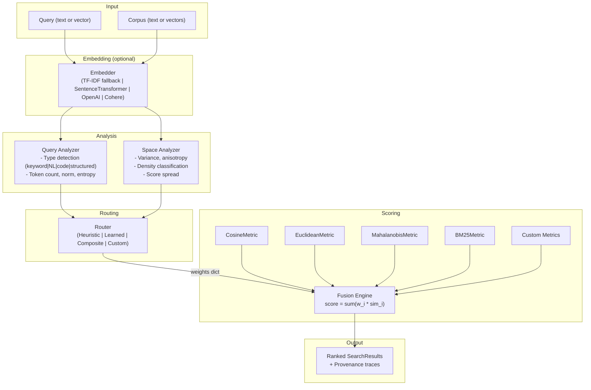

# refract -- Architecture & Concept Document

> *"Not all spaces are flat. Not all queries are equal. Not all similarity is the same."*

---

## What refract is

`refract` is a **context retrieval intelligence layer** -- a Python library that sits between raw vectors and whatever consumes them (RAG pipelines, search engines, context engines, code search tools).

Its central idea: **similarity is not a single function. It is a dynamic mixture of geometric perspectives, weighted by the nature of the query and the shape of the search space.**

This is distinct from:

- A vector database (stores and indexes -- refract operates on top of these)
- A RAG framework like LangChain or LlamaIndex (orchestrates LLM + retrieval -- refract is a drop-in retrieval step)
- A reranker (post-processes a fixed candidate set -- refract changes *how* scoring happens, not just the order after)
- A hybrid search library (combines BM25 + dense with static weights -- refract makes weights dynamic and space-aware)

---

## Pipeline flow



---

## The core problem with cosine similarity

Cosine similarity assumes:

1. The embedding space is Euclidean and isotropic
2. All dimensions contribute equally and independently
3. Angular distance is the right notion of "closeness" for all queries
4. The same metric works equally well regardless of what is being searched

None of these are true in practice. Transformer-generated embeddings are known to be **anisotropic** -- vectors cluster in narrow cones, making cosine less discriminative in dense regions. Hierarchical relationships (code -> module -> function) are not flat. The notion of similarity for a short keyword query is fundamentally different from a long natural language question.

---

## The refract model

```
score(x, y | q, S) = sum_i  w_i(q, S) * sim_i(x, y)
```

Where:
- `q` = the query (text, vector, or both)
- `S` = the search space (the candidate pool)
- `sim_i` = the i-th similarity metric (cosine, euclidean, mahalanobis, BM25, custom)
- `w_i(q, S)` = the weight assigned to metric i, **which depends on both the query AND the geometry of the candidate pool**

The critical innovation is in `w_i(q, S)`. Most hybrid search implementations use static weights (e.g. always 0.7 dense + 0.3 BM25). refract computes weights dynamically by analyzing:

**From the query:**
- Query type: keyword / natural language / code / structured data
- Query length and token count
- Embedding norm (a proxy for specificity)
- Query entropy across candidate scores (if scores are flat, one metric is not discriminating -- boost others)

**From the search space:**
- Embedding variance across candidates
- Anisotropy (how "cone-shaped" the candidate distribution is)
- Cluster density (is the space dense and uniform, or sparse and structured?)
- Score distribution shape (if top-k scores are bunched, fine-grained metrics matter more)

---

## Routing modes

### 1. Heuristic routing (default, zero training required)

Rule-based weight assignment using a lookup table indexed by `(query_type, density)`:

| Query Type | Space | Cosine | BM25 | Mahalanobis | Euclidean |
|---|---|---|---|---|---|
| keyword | sparse | 0.50 | 0.40 | -- | 0.10 |
| keyword | dense | 0.30 | 0.20 | 0.40 | 0.10 |
| natural_language | sparse | 0.65 | 0.25 | -- | 0.10 |
| natural_language | dense | 0.35 | 0.10 | 0.45 | 0.10 |
| code | * | 0.40-0.55 | 0.25-0.35 | 0-0.25 | 0.10 |
| structured | * | 0.25-0.40 | 0.40-0.50 | 0-0.25 | 0.10 |

**Dynamic adjustments applied after base lookup:**
- **Entropy adjustment:** If query entropy is high (flat scores), the dominant metric weight is reduced by 20% and redistributed.
- **Score spread adjustment:** If cosine score spread < 0.02 (cosine can't discriminate), mahalanobis weight is boosted by 0.15.

The rule table is exposed as `HeuristicRouter.rules` and can be inspected or overridden without subclassing.

### 2. Learned routing (optional, requires torch)

A small MLP gating network `f_theta(features) -> weights` trained on relevance feedback. Input: 13 features (query type one-hot, token count, norm, entropy, space density one-hot, variance, anisotropy, score spread). Output: softmax weights over metrics. Trainable via `LearnedRouter.fit()`.

### 3. Composite routing

Blends outputs from multiple sub-routers via weighted averaging. Useful for ensembling heuristic + learned approaches.

### 4. Custom routing (plugin system)

Users implement `BaseRouter.route()` and inject their own logic.

---

## Performance design decisions

### Caching

- `search_batch()` amortizes corpus embedding, space analysis, and metric fitting (Mahalanobis) across all queries.
- Space analysis computes eigenvalues once per corpus, not per query.

### Lazy computation

- Metrics with weight < 0.01 are **skipped entirely** in the fusion engine.
- BM25 is only initialized when text corpus is available.
- Optional embedders are lazy-imported -- no `torch` or `openai` import at package load time.

### Vectorized paths

- All built-in metrics implement `batch_score()` using vectorized NumPy operations (no Python loops).
- Mahalanobis uses `np.einsum` for batch distance computation.
- For large corpora (>5000 vectors), eigenvalue computation subsamples to 2000 vectors.

### TF-IDF fallback

When no embedder is provided and corpus is text, refract uses scikit-learn's `TfidfVectorizer` + `TruncatedSVD` as a lightweight fallback. This means `refract.search("query", docs)` works out of the box with zero configuration.

---

## Score provenance

Every result from `refract.search()` carries a provenance object explaining how the score was computed:

```python
result.provenance.to_dict()
# {
#   "final_score": 0.726,
#   "router": "heuristic",
#   "query_type": "natural_language",
#   "space_density": "medium",
#   "metrics": {
#     "cosine":      {"score": 0.895, "weight": 0.50, "weighted": 0.447},
#     "bm25":        {"score": 0.877, "weight": 0.15, "weighted": 0.132},
#     "mahalanobis": {"score": 0.412, "weight": 0.25, "weighted": 0.103},
#     "euclidean":   {"score": 0.513, "weight": 0.10, "weighted": 0.051},
#   }
# }
```

This is a first-class feature. Users should be able to understand *why* a result ranked first, not just that it did.

---

## Extensibility

### Adding a custom metric

1. Subclass `BaseMetric`, implement `score()` and optionally `batch_score()`
2. Pass instances directly to `refract.search(metrics=[..., MyMetric()])`
3. Or register globally via `DEFAULT_REGISTRY.register(MyMetric())`

### Adding a custom embedder

1. Subclass `BaseEmbedder`, implement `embed()`
2. Use lazy imports for the underlying library
3. Add as an optional dependency in `pyproject.toml`

### Adding a custom router

1. Subclass `BaseRouter`, implement `route()`
2. Pass to `refract.search(router=MyRouter())`
3. Or compose with `CompositeRouter([(HeuristicRouter(), 0.7), (MyRouter(), 0.3)])`

---

## Positioning relative to existing work

| Approach | What it does | refract difference |
|---|---|---|
| Hybrid search (BM25 + dense) | Static weight combination | Dynamic weights, space-aware |
| Learning to rank (LTR) | Combines features, learns weights | Geometry-aware metric routing with explainability |
| Mixture of Experts (MoE) | Gating network selects expert | Same idea, applied to similarity metrics with explicit space analysis |
| Rerankers (cross-encoders) | Re-scores post-retrieval | refract changes the scoring step itself |
| FAISS / ScaNN | ANN indexing and search | Infrastructure layer -- refract operates above this |
| Semantic Router | Routes queries to different handlers | refract routes *metrics*, not *handlers* |

The specific gap refract fills: **no general-purpose Python library exposes dynamic, query-and-space-aware metric routing as a clean API with score provenance and a benchmark harness.**

---

## Target use cases

- **RAG pipelines:** Drop in as the retrieval step before context is passed to the LLM
- **Code search:** Detect "code" query type, boost structural metrics
- **Business knowledge bases:** Dense, hierarchical corpora benefit from mahalanobis and space analysis
- **Semantic search products:** Any application where "find the most relevant X" matters
- **Research:** Experimenting with new similarity metrics without rebuilding infrastructure

---

## Non-goals for v1

- Real-time streaming search
- Distributed / sharded corpus support
- GPU-accelerated indexing (users bring their own)
- Multimodal embeddings (image, audio) -- text and code only in v1
- Hyperbolic embeddings -- target v2
