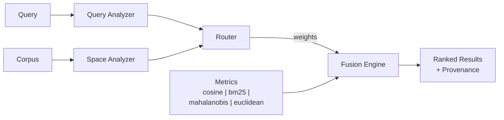

<p align="center">
  <h1 align="center">refract</h1>
  <p align="center"><strong>Smart similarity search that understands your query and your data.</strong></p>
</p>

<p align="center">
  <a href="https://github.com/ujjwalkumar26/refract/actions"></a>
  <a href="https://pypi.org/project/refract-search/"></a>
  <a href="https://pypi.org/project/refract-search/"></a>
  <a href="https://github.com/ujjwalkumar26/refract/blob/main/LICENSE"></a>
  <a href="https://github.com/ujjwalkumar26/refract"></a>
</p>

---

`refract` is a Python library that replaces static cosine similarity with a **dynamic, context-aware mixture of similarity metrics** -- weighted based on the nature of your query and the geometry of your search space. Every result comes with a **provenance trace** explaining exactly how it was scored.



---

## The problem with cosine similarity

Cosine similarity is the default for vector search. But it assumes the embedding space is flat and isotropic, that all dimensions contribute equally, and that the same metric works for every query type.

**None of these are true.** Transformer embeddings are anisotropic. Hierarchical relationships are not linear. The right notion of "similar" for `"sort list python"` is different from `"what are the philosophical implications of determinism"`.

---

## What refract does

Instead of `score(x, y) = cosine(x, y)`, refract computes:

```
score(x, y | query, space) = sum_i  w_i(query, space) * sim_i(x, y)
```

The weights `w_i` are determined **dynamically** by analyzing:

- **Query type** -- keyword, natural language, code, or structured data
- **Search space geometry** -- density, variance, anisotropy of the candidate pool
- **Discriminability** -- which metrics actually separate candidates for this query

---

## Why not just...

| Approach | What it does | refract difference |
|---|---|---|
| **Cosine similarity** | Single static metric | Refract dynamically routes across multiple metrics |
| **Hybrid search (BM25 + dense)** | Static weights (e.g., 0.7/0.3) | Weights are dynamic and space-aware |
| **Rerankers (cross-encoders)** | Post-processes a fixed candidate set | Refract changes **how** scoring happens, not just the order after |
| **Learning to rank** | Learns feature weights | Refract works out of the box (heuristic), with optional learned routing |
| **FAISS / Qdrant / Pinecone** | ANN indexing & search | Infrastructure layer -- refract operates **above** these |

---

## Install

```bash
# Core (numpy, scipy, scikit-learn, rank_bm25 only)
pip install refract-search

# With local embeddings
pip install "refract-search[sentence-transformers]"

# With OpenAI embeddings
pip install "refract-search[openai]"

# Everything
pip install "refract-search[all]"
```

---

## Quickstart

```python
import refract

docs = [
    "Sort a Python list using the sorted() built-in.",
    "Neural networks learn representations of data.",
    "Retrieve relevant documents from a large corpus.",
    "Use cosine similarity to measure vector closeness.",
]

results = refract.search("how do I sort things in Python", docs)

for r in results:
    print(f"{r.score:.3f}  {r.text}")
```

**Output:**
```
0.726  Sort a Python list using the sorted() built-in function.
0.357  Python decorators modify function behavior at definition time.
0.333  Use cosine similarity to measure vector closeness in embedding space.
```

---

## Score provenance

Every result explains **why** it ranked where it did:

```python
result = results[0]
print(result.provenance)
# Provenance(score=0.726, router='heuristic', query_type='natural_language',
#   density='medium',
#   [cosine=0.895x0.50, bm25=0.877x0.15, mahalanobis=0.412x0.25, euclidean=0.513x0.10])
```

---

## With an embedder

```python
from refract.embedders.sentence_transformers import SentenceTransformerEmbedder

embedder = SentenceTransformerEmbedder("all-MiniLM-L6-v2")
results = refract.search("machine learning fundamentals", docs, embedder=embedder)
```

---

## With pre-computed vectors

```python
import numpy as np

query_vec = np.random.randn(384)
corpus_vecs = np.random.randn(100, 384)

results = refract.search(query_vec, corpus_vecs)
```

---

## Batch search

Amortize corpus analysis across multiple queries:

```python
results = refract.search_batch(
    ["query one", "query two", "query three"],
    documents,
    top_k=5,
)
# Returns: list[list[SearchResult]]
```

---

## Custom metric

```python
from refract.metrics import BaseMetric
import numpy as np

class MyDomainMetric(BaseMetric):
    name = "my_metric"

    def score(self, query_vec: np.ndarray, candidate_vec: np.ndarray) -> float:
        return float(np.dot(query_vec, candidate_vec))

results = refract.search(query, docs, metrics=["cosine", "bm25", MyDomainMetric()])
```

---

## Custom router

```python
from refract.routing import BaseRouter

class MyRouter(BaseRouter):
    name = "my_router"

    def route(self, query_profile, space_profile, available_metrics):
        if query_profile.query_type == "code":
            return {"cosine": 0.7, "bm25": 0.3}
        return {"cosine": 0.5, "mahalanobis": 0.3, "bm25": 0.2}

results = refract.search(query, docs, router=MyRouter())
```

---

## Train a learned router from relevance feedback

Use your own judged queries to learn when each metric should matter more:

```python
from refract.routing import LearnedRouter

queries = [
    "how to sort a list in Python",
    "neural network architecture",
    "vector similarity embedding",
]
relevance = {
    0: {0, 16},
    1: {1, 8, 15},
    2: {3, 11, 19},
}

router = LearnedRouter(["cosine", "bm25", "mahalanobis", "euclidean"])
report = router.fit_from_relevance(
    queries=queries,
    corpus=docs,
    relevance=relevance,
    top_k=5,
)

print(report)
print(report.metric_quality)
```

`fit_from_relevance()` automatically:

- Builds query + space features
- Measures how well each metric ranks the relevant documents
- Converts those per-query metric scores into target routing weights
- Trains a small gating network to predict those weights later

---

## Use a trained router

```python
from refract.routing import LearnedRouter

router.save("learned_router.pkl")
trained_router = LearnedRouter.load("learned_router.pkl")

results = refract.search(
    "how do I sort things in Python",
    docs,
    router=trained_router,
)
```

---

## Evaluate learning

You can evaluate the learned router directly, then benchmark it against heuristic routing:

```python
evaluation = trained_router.evaluate_from_relevance(
    queries=queries,
    corpus=docs,
    relevance=relevance,
    top_k=5,
)
print(evaluation.router_ndcg_at_k, evaluation.oracle_ndcg_at_k)
```

```python
from refract.benchmark import BenchmarkHarness, CustomDataset

dataset = CustomDataset(
    name="my_eval",
    queries=queries,
    corpus=docs,
    relevance=relevance,
)

harness = BenchmarkHarness()
heuristic = harness.run(dataset, compare_cosine_baseline=False)[0]
learned = harness.run(dataset, router=trained_router, compare_cosine_baseline=False)[0]
```

---

## Use as a RAG retrieval step

```python
import refract

def retrieve(query: str, knowledge_base: list[str], top_k: int = 5) -> list[str]:
    results = refract.search(query, knowledge_base, top_k=top_k)
    return [r.text for r in results]

# Feed into your LLM
context = retrieve("What is the refund policy?", documents)
```

---

## Benchmarking

Prove it works on your data:

```python
from refract.benchmark import BenchmarkHarness, CustomDataset

dataset = CustomDataset(
    name="my_data",
    queries=["query 1", "query 2"],
    corpus=["doc 1", "doc 2", "doc 3"],
    relevance={0: {0}, 1: {1, 2}},
)

harness = BenchmarkHarness()
results = harness.run(dataset, compare_cosine_baseline=True)

for r in results:
    print(f"{r.method:20s}  NDCG@10={r.ndcg_at_10:.3f}  Recall@10={r.recall_at_10:.3f}")
```

---

## Routing modes

| Mode | When to use | Training required |
|---|---|---|
| `HeuristicRouter` (default) | Always -- good out of the box | No |
| `LearnedRouter` | When you have relevance feedback data and want adaptive routing | Yes |
| `CompositeRouter` | Blend multiple routers | Depends |
| `BaseRouter` subclass | Full custom control | You decide |

---

## Works with

refract is **not** a vector database or RAG framework. It makes the scoring step smarter. Use it with:

- **Vector DBs:** FAISS, Qdrant, Pinecone, Weaviate, Milvus, Chroma
- **RAG frameworks:** LangChain, LlamaIndex, Haystack
- **Embeddings:** OpenAI, Cohere, sentence-transformers, any custom model

---

## Design principles

- **Progressive complexity.** Five lines to get started. Full control available.
- **Embedding-agnostic.** Bring your own vectors; embedders are optional extras.
- **Explainable by default.** Every score comes with a provenance trace.
- **Pluggable everywhere.** Metrics, routers, and embedders all follow stable interfaces.
- **No reinventing the wheel.** Does not store vectors. Does not orchestrate LLMs. One job: smarter scoring.

---

## Project structure

```
src/refract/
  search.py          # Main API: refract.search(), refract.search_batch()
  types.py           # SearchResult, Provenance, QueryProfile, SpaceProfile
  analysis/          # Query type detection + space geometry analysis
  metrics/           # Cosine, Euclidean, Mahalanobis, BM25 + registry
  routing/           # HeuristicRouter, LearnedRouter, CompositeRouter
  fusion/            # Weighted score fusion with provenance
  embedders/         # SentenceTransformer, OpenAI, Cohere (optional)
  benchmark/         # Evaluation harness with NDCG, Recall, MRR
```

---

## Examples

| Example | Description |
|---|---|
| [`quickstart.py`](examples/quickstart.py) | 5-line usage demo |
| [`rag_pipeline.py`](examples/rag_pipeline.py) | RAG retrieval step |
| [`code_search.py`](examples/code_search.py) | Code similarity + query type detection |
| [`custom_metric.py`](examples/custom_metric.py) | Plug in your own metric |
| [`compare_cosine.py`](examples/compare_cosine.py) | Side-by-side vs vanilla cosine |
| [`benchmark_demo.py`](examples/benchmark_demo.py) | Evaluation harness demo |
| [`train_learned_router.py`](examples/train_learned_router.py) | Train a learned router from judged queries |
| [`evaluate_learned_router.py`](examples/evaluate_learned_router.py) | Compare heuristic vs learned routing |
| [`vector_db_integration.py`](examples/vector_db_integration.py) | FAISS/Qdrant integration pattern |

---

## Contributing

See [CONTRIBUTING.md](CONTRIBUTING.md) for development setup and guidelines.

---

## Roadmap

- `0.1.0` -- Core API, heuristic router, cosine / euclidean / mahalanobis / BM25
- `0.2.0` -- Learned router with relevance-driven training and evaluation **(you are here)**
- `0.3.0` -- BEIR benchmark harness with published results
- `1.0.0` -- Stable API, comprehensive benchmarks, documentation site

---

## License

[MIT](LICENSE)
